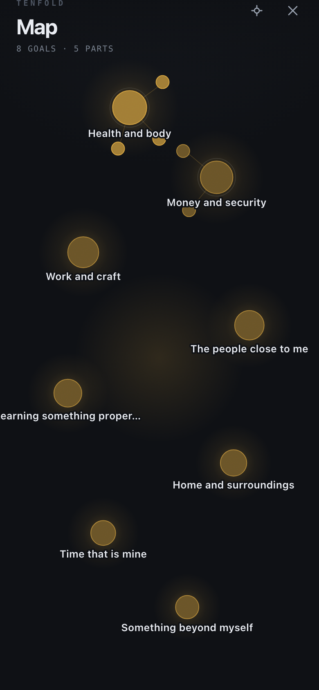

# tenfold

**tenfold — get what you want.**

tenfold holds one list: the ten things you truly want, in an honest order, each one
broken down level by level until a concrete first step is in front of you. The method
is not new — it is Raymond Hull's, from *How to Get What You Want* (1969) — and the
handwritten ritual it rests on stays: once a month, or whenever life shifts, you sit
down with paper and write your ten by hand. Writing is the thinking, and no software
takes that off your hands. The app takes over what paper cannot: it never loses a
thought, it unfolds each goal until the steps are doable, it keeps the order
incorruptible by asking one pair at a time instead of ten things at once, and it
encrypts everything so the list stays yours alone.

| The ten | One goal | The honest order | The whole thing at once |
|---|---|---|---|
|  |  |  |  |

---

## Zero-knowledge architecture

Everything is encrypted on the device, with keys derived from a passphrase that never
leaves it. The server is a mailbox for blobs it cannot read, and it has no code path
that could decrypt one — no key material, no cipher, no decrypt call anywhere in
`tools/serve.js`. That is asserted by a test, not by a promise.

```
   device                                     server (tools/serve.js)
   ------------------------------------       ------------------------------------
   passphrase ─┐
               ├─ PBKDF2 ─ KEK ─┐
   recovery ───┘                ├─ unwraps ─ master key (AES-256-GCM)
                                │                │
   doc {nodes, entities,        │                │ seal()
        settings}  ─────────────┴────────────────┴──► ciphertext blob
                                                          │
   IndexedDB  ◄── vault (ciphertext only) ────────────────┤
                                                          │  PUT /api/vault/<syncId>
                                                          └──────────────► vaults/<syncId>.json
                                                                           { version, vault,
                                                                             tokenHash, history }

   push.js ── endpoint URL + hour ──► POST /api/push/subscribe ──► push.json
                                      (server sends an EMPTY notification once a day)

   llm.js  ── {upstream, model, apiKey?, messages} ──► POST /api/llm ──► allowlisted
                                                        (pipe, stores nothing)   provider
```

**What the server can see:** the ciphertext, its size, a monotonic version counter, the
SHA-256 hash of a write token, the `syncId` it is filed under, the browser-issued push
endpoint and one hour of the day, and — while a model request is in flight — the
plaintext of that one request as it passes through the relay. Access log lines carry at
most the first six characters of a `syncId`.

**What the server cannot see:** any title, note, story, entity card, setting or
passphrase; who owns which `syncId`; how many goals a vault holds. It cannot merge two
versions, because merging would mean decrypting — the client does that and pushes the
result back.

### The vault format

A `VaultFile` is plain JSON with binary parts in base64url, so it fits into IndexedDB
and into an export file unchanged: `{ magic, version, wrappers[], payload }`.

- `magic` is `"TENFOLD1"`, `version` is `1` (`web/js/crypto.js`).
- **Wrappers** are independent envelopes around one random 256-bit master key. Each one
  alone can release it: `kind: "passphrase"`, `kind: "recovery"`, or `kind: "raw"` (a
  32-byte device key, prepared for WebAuthn PRF / Face ID, which does not exist yet).
  Adding or revoking a device is adding or removing a wrapper; the document is never
  re-encrypted for it.
- **KDF** for the passphrase and the recovery key: PBKDF2-SHA256, 600 000 iterations,
  16-byte random salt, via WebCrypto. An iteration count read back from a vault is
  bounded (100 000 … 5 000 000) before any work is spent on it.
- **AAD**: each wrapper's ciphertext is bound to its own metadata — `magic`, `version`,
  `id`, `kind`, `label`, the canonical `kdf` block and the `nonce`. Lowering the
  iteration count, swapping a salt, relabelling a wrapper or changing its kind all fail
  the GCM tag check instead of quietly producing a weaker vault. The scope is per
  wrapper on purpose: enrolling a new device must not invalidate the passphrase
  envelope.
- **Payload**: `MAGIC(8) | version(1) | algorithm(1) | nonce(12) | ciphertext`, sealed
  with AES-256-GCM under a fresh 12-byte nonce per call, with that header as AAD.
- `store.js` refuses to write anything carrying a `nodes`, `doc`, `plaintext` or
  `settings` key into IndexedDB. Only the sealed vault is ever stored.

### Sync mailbox

Off by default; switching it on is a deliberate act in settings.

- `syncId` — 26 symbols of a confusable-free base32 alphabet, generated on the device.
  Knowing it grants read of the ciphertext, nothing more; it is not derived from any
  secret.
- `authToken` — HKDF-SHA256 over the master key. Only a device that can open the vault
  can derive it. The server stores its SHA-256 hash, registered on the first PUT (trust
  on first use). `PUT` requires the token; `GET` does not, because a new device has to
  fetch the blob before it can decrypt anything.
- `GET /api/vault/<syncId>` → `{ version, vault }`. `PUT` with `X-Sync-Token` and
  `X-If-Version` → `200`, or `409` with the current record when the version is stale.
  The client then decrypts both copies, merges them (younger `updatedAt` wins, the
  losing text is appended under a `--- divergent version ---` marker rather than
  dropped), re-seals and pushes again. The server never merges.
- Last 10 versions kept per id, 4 MB blob cap, `syncId` validated against
  `^[a-z0-9]{26}$`. No token and no body is ever logged.

### Push

Optional, off by default, requires sync plus browser permission. The server generates a
VAPID P-256 pair once — a **signing** key for push identity, which can decrypt nothing —
and sends an **empty** notification once a day at the hour the device asked for. Only
`sub.endpoint` is kept; the subscription's own encryption keys are deliberately
dropped. The service worker never reads `event.data` (there is none) and shows a fixed
localised sentence from its own small catalogue. This is the one outbound call in the
whole system.

### The model relay

`POST /api/llm` exists because a browser cannot reach most providers directly (CORS) and
a phone outside the flat cannot reach a model on the home network. It is a pipe, not a
store: nothing that passes through is written to disk, kept past the request, counted or
logged.

- **SSRF wall.** `upstream` must either be on the built-in cloud host list
  (`api.openai.com`, `api.anthropic.com`, `openrouter.ai`, `api.mistral.ai`,
  `api.groq.com`, https only) or match one of the operator-configured base URLs in
  `TENFOLD_LLM_UPSTREAMS` exactly. Anything else is refused with 403 before a socket is
  opened. Redirects are never followed, no caller header is passed on, and only four
  fields of the body travel onward.
- **Auth.** The relay requires a valid `X-Sync-Token` for a vault that exists on this
  server, or a loopback caller with no `cf-connecting-ip`. Without that, strangers could
  burn the operator's local models through the tunnel.
- Caps: 1 MB request body, 8 MB when an image part travels with it, 1 MB response,
  120 s timeout, non-streaming. The per-IP rate limiter covers it like every other API
  path.

---

## Threat model

**Protected against**

- A stolen or seized server: it holds ciphertext, version numbers and token hashes. The
  operator cannot read a list, including their own users' lists.
- A stolen or seized device while the app is locked: IndexedDB holds only the vault, and
  the master key is wiped from memory on lock and after 15 minutes of inactivity.
- Network observation: everything that leaves the device is sealed, except what you
  deliberately send to a model.
- Tampering with a vault: parameter changes, salt swaps and ciphertext edits fail the
  GCM tag check rather than degrading quietly.
- Injected markup from any source, including a model answer: nothing in `web/` builds
  DOM from strings — no `innerHTML`, no `eval`, no inline handlers, enforced by a source
  test. In a zero-knowledge app an injected script would hold the plaintext and the key
  at the same time.

**Not protected against**

- **Whoever runs the model sees plaintext while it thinks.** In cloud mode the goal you
  are working on — its title, story and linked cards — is processed by the provider you
  chose. In local mode it is processed by whatever runs on that machine. This is the
  price of assistance, which is why it is off by default and switched on per vault.
- **Metadata the server can see:** that a `syncId` exists, when it was written, how
  large the blob is, how often it changes, and the IP address a request came from while
  it is being rate-limited (never written to disk).
- **An unlocked device in someone else's hands** lays everything open. So does a
  compromised operating system, a keylogger, or a browser extension with page access.
- **A forgotten passphrase with no recovery key and no export**, see below.
- The server proves nothing about authorship. AEAD detects tampering; an attacker who
  can rewrite storage can still replace a whole file with a different one.
- Traffic analysis, and anyone who can watch both your device and the provider.

---

## Recovery

Three independent ways in, and they are genuinely independent — each is its own wrapper
around the same master key.

1. **Passphrase.** What you type on the lock screen. Never stored, never transmitted,
   never recoverable.
2. **Recovery key.** Shown once during setup: 7 groups of 4 from a confusable-free
   alphabet (no I, L, O, U, 0, 1), 137 bits. Write it down on paper. Input tolerates
   case, spaces and hyphens. It unlocks the vault without the passphrase; it does not
   reveal the passphrase.
3. **Export file.** Settings → export writes a `.tenfold` file: the same encrypted
   vault, all wrappers included. It still needs a passphrase or a recovery key to open.
   A separate plaintext Markdown export exists, behind an explicit confirmation — that
   one is readable by anyone who gets the file.

If the passphrase is forgotten, the recovery key is lost and no export exists, **the
data is gone. All of it. Permanently.** There is no reset link, no support address that
can help, no key escrow, no backdoor. Nobody — including whoever runs the server — holds
anything that could open the vault. That is the point of the design, and it is the cost
of it.

Rotating after a suspected device loss: `rotateMasterKey` re-wraps under a new master
key and drops every raw device wrapper.

---

## Assistance: three modes, off by default

`doc.settings.llm` lives inside the sealed vault; the server never stores any of it,
including the API key.

- **off** — the default. Not a single AI control exists in the DOM. Not hidden, absent.
- **local** — an OpenAI-compatible server on your own machine (LM Studio, llama.cpp,
  Ollama's compatible endpoint). Nothing leaves the network you are on. The operator
  has to name the address in `TENFOLD_LLM_UPSTREAMS`.
- **cloud** — a provider from the allowlist. Switching to it requires a one-time consent
  sheet that states plainly what leaves the device.

In every mode the rules are the same: only the goal being worked on travels — its
chain, its immediate neighbours and its linked cards, never the whole tree. A subtree
marked "keep away from the model" never appears in any request. Cards marked sensitive
stay on the device unless released for one single call, and in cloud mode the notes on a
card stay behind as well. Every answer is a proposal: it is rendered as an acceptable
diff and applied item by item through the normal mutation path, with `origin: "llm"` on
everything it creates. Nothing a model says writes itself.

The same applies to importing a photographed list: the picture is resized on the device,
read once, and comes back as an indented checklist you correct and accept line by line.

---

## Running it

```sh
node tools/serve.js          # http://127.0.0.1:7710
```

No build step, no dependencies at runtime. The app is plain ES modules served straight
from `web/`.

| Variable | Default | What it does |
|---|---|---|
| `PORT` | `7710` | Listen port; bound to `127.0.0.1` only |
| `TENFOLD_DATA` | `~/.tenfold-data` | Where vaults, VAPID pair and push records live. Never inside the repository |
| `TENFOLD_MAX_VAULTS` | `500` | Global cap on stored vaults; the next `PUT` for a new id gets 507 |
| `TENFOLD_LLM_UPSTREAMS` | *(empty)* | Comma-separated base URLs of local model servers the relay may reach, matched exactly, e.g. `http://127.0.0.1:1234/v1` |
| `TENFOLD_PUSH_SUBJECT` | `mailto:tenfold@localhost` | Contact address in the VAPID claim; operator data, never user data |

Keeping it alive on macOS (`tools/com.tenfold.serve.plist`):

```sh
cp tools/com.tenfold.serve.plist ~/Library/LaunchAgents/
launchctl load ~/Library/LaunchAgents/com.tenfold.serve.plist
```

```xml
<key>ProgramArguments</key>
<array>
  <string>/usr/local/bin/node</string>
  <string>/Users/you/tenfold/tools/serve.js</string>
</array>
<key>WorkingDirectory</key><string>/Users/you/tenfold</string>
<key>RunAtLoad</key><true/>
<key>KeepAlive</key><true/>
```

Reaching it from a phone means putting a tunnel or a reverse proxy in front of it. The
server itself listens on loopback and speaks plain HTTP; TLS is the tunnel's job.

### Tests

```sh
npx playwright test                    # the whole suite, headless Chromium
npx playwright test tests/crypto.spec.js
```

The suite runs against its own server instance on port 7711 with a throwaway data
directory, never against a running production server. It covers the crypto round trip,
every envelope on its own, tamper detection, the merge rules, the plaintext-leak
guarantee of the store, i18n key-set equality across all three locales, the source rules
(no `innerHTML`, no `eval`, no fetch outside the three modules allowed to have it, no
emoji), the SSRF wall of the relay, and the full chain from setup to sync.

---

## Layout

```
web/            the app: index.html, css/, js/ (pure ES modules, no bundler)
  js/crypto.js  the vault: wrappers, seal/open, key rotation
  js/model.js   pure tree functions, merge, schema upgrade
  js/sync.js    the only module allowed to talk to /api/vault
  js/push.js    the only module allowed to talk to /api/push
  js/llm.js     the only module allowed to talk to /api/llm
  js/ui/        one file per screen and per sheet
tools/serve.js  the whole server: static files, vault mailbox, push, relay
docs/CONTRACTS.md  the binding interface contract between all of the above
design/         the three skins as static pages, plus screenshots
tests/          Playwright specs
```

`docs/CONTRACTS.md` is the contract every module is built against. Anyone who wants to
change an interface changes that file first.

## License

MIT. See [LICENSE](LICENSE).
