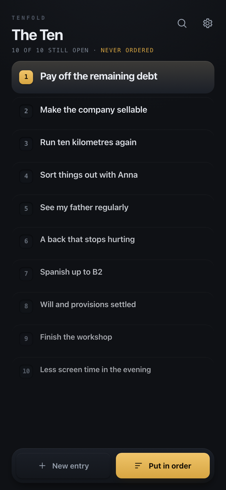
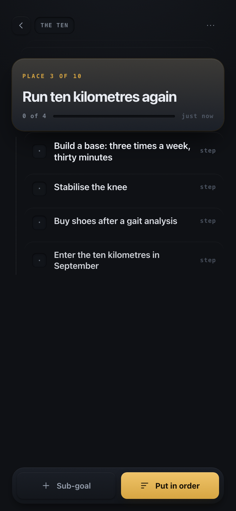
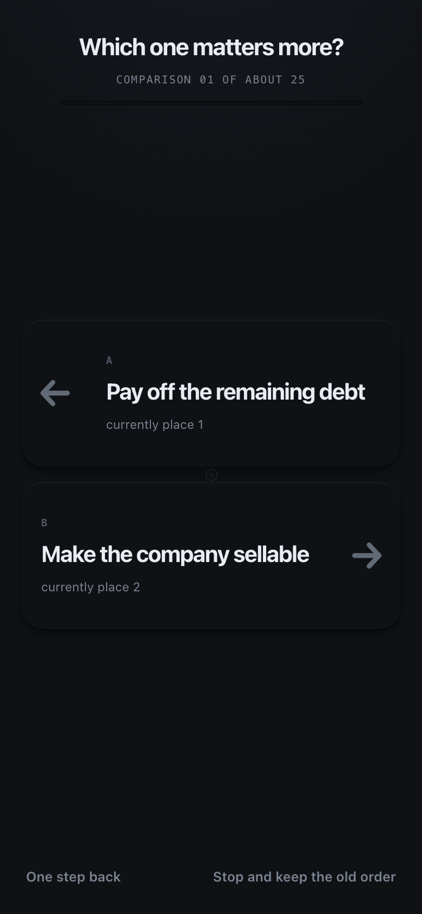
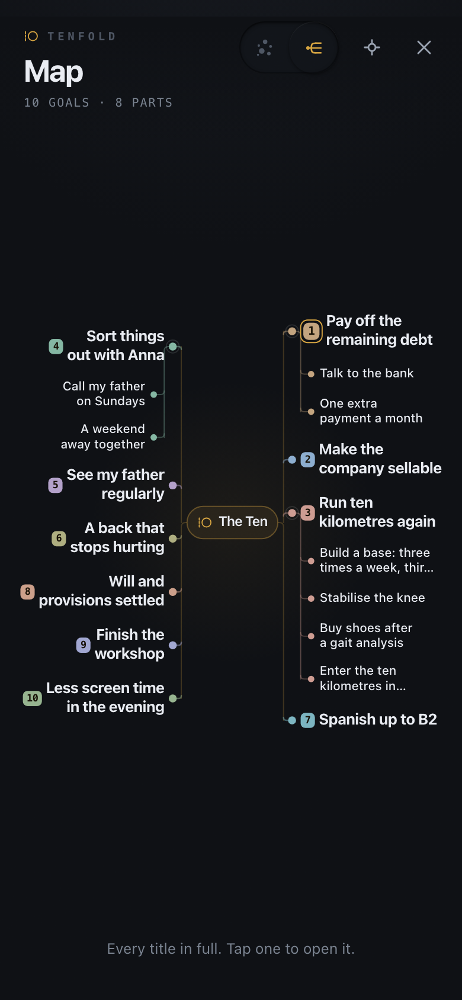

# tenfold

[](https://github.com/freshlabde/tenfold/actions/workflows/test.yml)

**tenfold - get what you want.**

tenfold holds one list: the ten things you truly want, in an honest order, each one
broken down level by level until a concrete first step is in front of you. The method
is not new. It is Raymond Hull's, from *How to Get What You Want* (1969), and the
handwritten ritual it rests on stays: once a month, or whenever life shifts, you sit
down with paper and write your ten by hand. Writing is the thinking, and no software
takes that off your hands. The app takes over what paper cannot: it never loses a
thought, it unfolds each goal until the steps are doable, it keeps the order
incorruptible by asking one pair at a time instead of ten things at once, and it
encrypts everything so the list stays yours alone.

| The ten | One goal | The honest order | The whole thing at once |
|---|---|---|---|
|  |  |  |  |

---

## The list on a screen

Ten one-line goals stand on a phone at once, rank one and rank ten both whole, nothing
to scroll. Importance is three bands rather than a gradient: the lead row is tallest and
loudest, ranks two and three sit in the middle, rank four and below are compact. A slope
of four percent a step had shipped before that and was invisible at arm's length. With
ten living goals the "New entry" button is disabled, because eleven no longer fits the
budget the bands are built on. A title that wraps to two lines may push past it, and it
is the only thing allowed to: nothing here shortens a goal to make the sums work.

A row is a small piece of direct manipulation. Swiping right finishes a step, swiping
left deletes the node with an undo toast as the only safety net, and a long press lifts
the row to reorder. The Today screen collects what is overdue or due today, at most
seven, each step named by the whole chain it hangs in, since a step called "M&V" only
means something under its goal. The due part of a row carries the colour, never the
whole row.

The map draws the same tree twice. The mind map is where it opens: every title in full,
laid out left and right of the centre, one family colour per goal, tap a node to open
it. The constellation is one toggle away and reads as atmosphere rather than structure,
and it is the view that carries the context cards, one hollow diamond per person, place,
organisation or topic, threaded to every step it touches. A card is selected first and
opened second, so a fingertip on a small glyph cannot skip a screen ahead.

Things get in and out without typing. An answer pasted back from whatever AI you already
use comes back as an indented checklist, shown in full before a single line is written. A
note shared from another Android app lands in a sheet at the next unlock that asks the only
question that matters: which goal does this belong to. A second device is paired by scanning a QR
code, or by photographing it where the browser has no barcode detector of its own. The
recovery key can be printed as a one-page emergency sheet during setup. The app icon
carries the number of steps due, and nothing else. On a desktop or an iPad the whole
thing centres itself in one frame and caps the text at a readable measure instead of
stretching a phone layout across a monitor.

---

## Zero-knowledge architecture

Everything is encrypted on the device, with keys derived from a passphrase that never
leaves it. The server is a mailbox for blobs it cannot read, and it has no code path
that could decrypt one: no key material, no cipher, no decrypt call anywhere in
`tools/serve.js`. That is asserted by a test, not by a promise.

```
   device                                     server (tools/serve.js)
   ------------------------------------       ------------------------------------
   passphrase ─┐
               ├─ PBKDF2 ─ KEK ─┐
   recovery ───┘                ├─ unwraps ─ master key (AES-256-GCM)
   Face ID / fingerprint ───────┘                │
                                │                │ seal()
   doc {nodes, entities,        │                │
        settings}  ─────────────┴────────────────┴──► ciphertext blob
                                                          │
   IndexedDB  ◄── vault (ciphertext only) ────────────────┤
                                                          │  PUT /api/vault/<syncId>
                                                          └──────────────► vaults/<syncId>.json
                                                                           { version, vault,
                                                                             tokenHash, history }

   push.js ── endpoint URL + hour ──► POST /api/push/subscribe ──► push.json
                                      (server sends an EMPTY notification once a day)
```

**What the server can see:** the ciphertext, its size, a monotonic version counter, the
SHA-256 hash of a write token, the `syncId` it is filed under, the browser-issued push
endpoint and one hour of the day. Nothing else passes through it: until v1.1 a model relay
also handled the plaintext of one request while it was in flight, and that is gone. Access
log lines carry at most the first six characters of a `syncId`.

**What the server cannot see:** any title, note, story, entity card, setting or
passphrase; who owns which `syncId`; how many goals a vault holds. It cannot merge two
versions, because merging would mean decrypting. The client does that and pushes the
result back.

### The vault format

A `VaultFile` is plain JSON with binary parts in base64url, so it fits into IndexedDB
and into an export file unchanged: `{ magic, version, wrappers[], payload }`.

- `magic` is `"TENFOLD1"`, `version` is `1` (`web/js/crypto.js`).
- **Wrappers** are independent envelopes around one random 256-bit master key. Each one
  alone can release it: `kind: "passphrase"`, `kind: "recovery"`, or `kind: "raw"`, a
  32-byte device key. Adding or revoking a device is adding or removing a wrapper; the
  document is never re-encrypted for it.
- **Biometric unlock** uses that raw wrapper. Touch ID, Face ID, Windows Hello or an
  Android screen lock evaluate the WebAuthn PRF extension over a per-vault salt, the
  result is hashed once and becomes one more envelope (`web/js/webauthn.js`). What is
  stored on the device is a credential id and that salt, both non-secret: without the
  authenticator and the user verification it insists on, they derive nothing. The master
  key never touches storage. Every device enrols its own credential, so revoking on one
  leaves the others alone, and the passphrase path never goes away.
- **KDF** for the passphrase and the recovery key: PBKDF2-SHA256, 600 000 iterations,
  16-byte random salt, via WebCrypto. An iteration count read back from a vault is
  bounded (100 000 to 5 000 000) before any work is spent on it.
- **AAD**: each wrapper's ciphertext is bound to its own metadata: `magic`, `version`,
  `id`, `kind`, `label`, the canonical `kdf` block and the `nonce`. Lowering the
  iteration count, swapping a salt, relabelling a wrapper or changing its kind all fail
  the GCM tag check instead of quietly producing a weaker vault. The scope is per
  wrapper on purpose: enrolling a new device must not invalidate the passphrase
  envelope.
- **Payload**: `MAGIC(8) | version(1) | algorithm(1) | nonce(12) | ciphertext`, sealed
  with AES-256-GCM under a fresh 12-byte nonce per call, with that header as AAD.
- `store.js` refuses to write anything carrying a `nodes`, `doc`, `plaintext` or
  `settings` key into IndexedDB. Only the sealed vault is ever stored.

### Sync mailbox

Off by default; switching it on is a deliberate act in settings.

- `syncId`: 26 symbols of a confusable-free base32 alphabet, generated on the device.
  Knowing it grants read of the ciphertext, nothing more; it is not derived from any
  secret.
- `authToken`: HKDF-SHA256 over the master key. Only a device that can open the vault
  can derive it. The server stores its SHA-256 hash, registered on the first PUT (trust
  on first use). `PUT` requires the token; `GET` does not, because a new device has to
  fetch the blob before it can decrypt anything.
- `GET /api/vault/<syncId>` → `{ version, vault }`. `PUT` with `X-Sync-Token` and
  `X-If-Version` → `200`, or `409` with the current record when the version is stale.
  The client then decrypts both copies, merges them (younger `updatedAt` wins, the
  losing text is appended under a `--- divergent version ---` marker rather than
  dropped), re-seals and pushes again. The server never merges.
- `DELETE /api/vault/<syncId>` lets the mailbox go of what it holds, and it demands the
  token from **every** caller, loopback included. The exemption that local callers enjoy
  elsewhere is waived here on purpose: a half-written cron job pointed at the wrong port
  must not be able to destroy what it cannot open. What goes is the whole id directory,
  history files and push subscriptions with it, renamed aside before it is removed so no
  half-emptied record is ever served. Nothing is kept, not even a marker that the id
  existed; afterwards the next PUT registers it again as a brand-new mailbox.
- Last 10 versions kept per id, 4 MB blob cap, `syncId` validated against
  `^[a-z0-9]{26}$`. No token and no body is ever logged.

### Push, and the number on the icon

Optional, off by default, requires sync plus browser permission. The server generates a
VAPID P-256 pair once, a **signing** key for push identity which can decrypt nothing,
and sends an **empty** notification once a day at the hour the device asked for. Only
`sub.endpoint` is kept; the subscription's own encryption keys are deliberately
dropped. The service worker never reads `event.data` (there is none) and shows a fixed
localised sentence from its own small catalogue. This is the one outbound call in the
whole system.

The app badge says one thing: how many open steps are overdue or due today, the same two
groups the Today screen ranks first, counted by the same function so the icon can never
claim something the app denies. A count, never a title, never a date, and the badge
survives the lock, because a number that vanishes the moment the vault locks would never
be seen. On a push the worker holds no key and cannot count, so it sets the badge with
no argument at all: there is something. The next unlock corrects it.

### What another app hands in

An installed Android app can share a note into tenfold. The share target is declared
`POST`, which is the privacy argument rather than a detail: with `GET` the shared text
would sit in the URL, the history and any screenshot of either. The service worker
answers that one POST, parks the item in a cache bucket of its own and redirects, and at
the next unlock a sheet asks where it belongs.

That parked item is plaintext, and this is written down rather than hidden. A service
worker has no key and cannot have one, so it cannot encrypt what it receives. The window
runs from the moment of sharing until the next unlock, after which the text is either
filed into the sealed vault or dropped and the bucket is deleted either way. If no
worker is in control, the POST reaches `tools/serve.js`, which drains the body unread,
not parsed, not buffered, not written, not logged, and redirects to the app.

### Offline, and how an update arrives

The app is a service worker plus a precached shell, so it opens without a network. A new
worker installs, skips waiting and claims its clients, and the page reloads itself once
when a new worker takes control, guarded so that the first visit never reloads and the
reload cannot loop. Every return to the foreground asks for an update check. There is no
banner, no prompt and no "reload to update" button anywhere.

---

## Threat model

**Protected against**

- A stolen or seized server: it holds ciphertext, version numbers and token hashes. The
  operator cannot read a list, including their own users' lists.
- A stolen or seized device while the app is locked: IndexedDB holds only the vault, and
  the master key is wiped from memory on lock and after 15 minutes of inactivity.
- Network observation: everything that leaves the device is sealed, except what you
  deliberately send to a model.
- Tampering with a vault: parameter changes, salt swaps and ciphertext edits fail the
  GCM tag check rather than degrading quietly.
- A stray local script deleting a mailbox: `DELETE` requires the key-derived token, from
  every caller, so only a device that can open the vault can destroy it.
- Injected markup from any source, including a model answer: nothing in `web/` builds
  DOM from strings, no `innerHTML`, no `eval`, no inline handlers, enforced by a source
  test. In a zero-knowledge app an injected script would hold the plaintext and the key
  at the same time.

**Not protected against**

- **Whatever you carry to an AI yourself.** The app never connects to one, but the prompt
  it writes is meant to be taken somewhere, and wherever you paste it - a chat window, a
  provider, a model on your own machine - that place sees the goal you are working on, its
  story and the names on its cards, under its terms and not ours. The scope is narrow and
  named on screen before you copy, and the decision is a deliberate act each time.
- **A note shared in from another app is plaintext until you unlock.** The worker that
  catches it has no key. The window is short and the bucket is emptied at the next
  unlock either way, but it is a window.
- **Metadata the server can see:** that a `syncId` exists, when it was written, how
  large the blob is, how often it changes, and the IP address a request came from while
  it is being rate-limited (never written to disk).
- **Aggregate visitor counts, if the operator switched them on** (`TENFOLD_STATS_KEY`,
  absent by default). Then the server keeps per UTC day: how many times the app's page
  was loaded, how many distinct visitors, which external referrer hosts and countries,
  mobile against desktop, and a separate bot count. Sums only - no IP, no user agent, no
  cookie, no identifier and nothing that links two days of one person ever reaches the
  disk, and no `/api/` request is counted at all. With the variable unset nothing is
  recorded and the page does not exist.
- **The badge is a number on a locked device.** Content-free by design, and still one
  bit more than nothing: it says how many steps are due.
- **An unlocked device in someone else's hands** lays everything open. So does a
  compromised operating system, a keylogger, or a browser extension with page access.
- **A forgotten passphrase with no recovery key and no export**, see below.
- The server proves nothing about authorship. AEAD detects tampering; an attacker who
  can rewrite storage can still replace a whole file with a different one.
- Traffic analysis, and anyone who can watch both your device and the provider.

---

## Recovery

Three independent ways in, and they are genuinely independent: each is its own wrapper
around the same master key.

1. **Passphrase.** What you type on the lock screen. Never stored, never transmitted,
   never recoverable.
2. **Recovery key.** Shown once during setup: 7 groups of 4 from a confusable-free
   alphabet (no I, L, O, U, 0, 1), 137 bits. Write it down on paper. The setup step
   offers a printable one-page emergency sheet that carries the key twice, as text to
   transcribe and as a QR code, with a ruled blank for a passphrase hint in your own
   hand. That sheet is offered once, in setup, and cannot resurrect the key afterwards.
   Input tolerates case, spaces and hyphens. It unlocks the vault without the
   passphrase; it does not reveal the passphrase.
3. **Export file.** Settings, then export, writes a `.tenfold` file: the same encrypted
   vault, all wrappers included. It still needs a passphrase or a recovery key to open.
   A separate plaintext Markdown export exists behind an explicit confirmation, and that
   one is readable by anyone who gets the file.

Biometric unlock is a convenience, not a fourth way in: it lives on one device, and a
device that is gone takes its envelope with it.

If the passphrase is forgotten, the recovery key is lost and no export exists, **the
data is gone. All of it. Permanently.** There is no reset link, no support address that
can help, no key escrow, no backdoor. Nobody, including whoever runs the server, holds
anything that could open the vault. That is the point of the design, and it is the cost
of it.

Rotating after a suspected device loss: `rotateMasterKey` re-wraps under a new master
key and drops every raw device wrapper.

Leaving is its own act. "Delete the vault everywhere" in settings names what dies before
anything happens, and it deletes the server copy first: if that fails, the flow stops
and offers to delete only this device rather than half-deleting quietly.

---

## Assistance: you are the transport

There is no model integration to configure, because there is none. tenfold writes the
prompt for one goal - where it sits, its story, the steps under it, the names on the cards
linked to it - and you carry it to whatever AI you already use and paste the answer back.
No key, no provider address, no relay, nothing to switch on and nothing that can be on by
accident. It works offline, in a browser with no server behind it, and inside the native
shell.

What enters that text is scoped and the scope is strict: only the goal being worked on,
the goals it hangs under, its direct steps and the linked cards by name and relation.
Never the whole tree. A subtree marked "keep away from the model" produces no prompt at
all - not a reduced one. Cards marked sensitive and the notes on ANY card never travel;
there is no per-call release, because a text on the clipboard has no single call to
release it for. What was held back is named in the prompt, so the model does not fill the
gap with a guess, and the sheet says the same thing in one line before anything is copied.

Coming back, the answer is parsed as an indented outline, shown in full with its levels,
and only Apply writes anything - as ordinary nodes through the normal mutation path, with
`origin: "llm"` on everything it creates. Nothing a model says writes itself.

**1.1 removed the built-in relay and the photo import in favour of this loop; v1.0.0 keeps
them in git history.** What went: `POST /api/llm` with its SSRF wall and caller gate, the
three-mode settings group with provider and API key, the seven model operations, and the
camera button that read a photographed list through the same relay.

---

## Running it

```sh
node tools/serve.js          # http://127.0.0.1:7710
```

No build step, no dependencies at runtime. The app is plain ES modules served straight
from `web/`.

| Variable | Default | What it does |
|---|---|---|
| `PORT` | `7710` | Listen port; bound to `127.0.0.1` only |
| `TENFOLD_DATA` | `~/.tenfold-data` | Where vaults, VAPID pair and push records live. Never inside the repository |
| `TENFOLD_MAX_VAULTS` | `500` | Global cap on stored vaults; the next `PUT` for a new id gets 507 |
| `TENFOLD_PUSH_SUBJECT` | `mailto:tenfold@localhost` | Contact address in the VAPID claim; operator data, never user data |
| `TENFOLD_STATS_KEY` | *(empty = off)* | Opt-in visitor counters. Unset: nothing is counted and `/stats` 404s. Set: aggregate per-day counts (loads, visitors, referrer hosts, countries, mobile/desktop, bots) in `stats.json`, readable at `/stats?k=<key>`; no IP or identifier is ever stored ([contracts](docs/CONTRACTS.md)) |

Keeping it alive on macOS (`tools/com.tenfold.serve.plist`):

```sh
cp tools/com.tenfold.serve.plist ~/Library/LaunchAgents/
launchctl load ~/Library/LaunchAgents/com.tenfold.serve.plist
```

```xml
<key>ProgramArguments</key>
<array>
  <string>/usr/local/bin/node</string>
  <string>/Users/you/tenfold/tools/serve.js</string>
</array>
<key>WorkingDirectory</key><string>/Users/you/tenfold</string>
<key>RunAtLoad</key><true/>
<key>KeepAlive</key><true/>
```

Reaching it from a phone means putting a tunnel or a reverse proxy in front of it. The
server itself listens on loopback and speaks plain HTTP; TLS is the tunnel's job.

### Tests

```sh
npx playwright test                    # the whole suite, headless Chromium
npx playwright test tests/crypto.spec.js
```

359 tests in 28 spec files, run against the app's own server instance on port 7711 with
a throwaway data directory, never against a running production server. They cover the
crypto round trip, every envelope on its own including WebAuthn PRF, tamper detection,
the merge rules, the plaintext-leak guarantee of the store, both readings of the map,
the row gestures, the QR encoder and the hand-written photo decoder, sync, pairing and
delete-everywhere, the copy loop and what may never enter its prompt, the visitor counters
including the proof that they stay absent unless switched on, i18n key-set equality
across all three locales, the wide viewport tier, the source rules (no `innerHTML`, no
`eval`, no fetch outside the two modules allowed to have it, no emoji), and the full
chain from setup to sync.

---

## Layout

```
web/            the app: index.html, sw.js, css/, js/ (pure ES modules, no bundler)
  js/crypto.js  the vault: wrappers, seal/open, key rotation
  js/webauthn.js  the biometric envelope: WebAuthn PRF to a raw wrapper
  js/model.js   pure tree functions, merge, schema upgrade
  js/sync.js    the only module allowed to talk to /api/vault
  js/push.js    the only module allowed to talk to /api/push
  js/aihelp.js  the copy loop: the prompt builder and the answer parser, both pure
  js/qr.js      QR encoder, and js/qrread.js the decoder for a photographed code
  js/badge.js   the count on the app icon, js/shareinbox.js what another app hands in
  js/locales/   en, de, es, with identical key sets
  js/ui/        one file per screen and per sheet
tools/serve.js  the whole server: static files, vault mailbox, push
docs/CONTRACTS.md  the binding interface contract between all of the above
design/         the three skins as static pages, plus screenshots
tests/          Playwright specs
```

`docs/CONTRACTS.md` is the contract every module is built against. Anyone who wants to
change an interface changes that file first.

## Version

1.0.0, shown at the foot of the settings screen. What changes from here is written into
`docs/CONTRACTS.md` before it is written into code.

## License

MIT. See [LICENSE](LICENSE).
